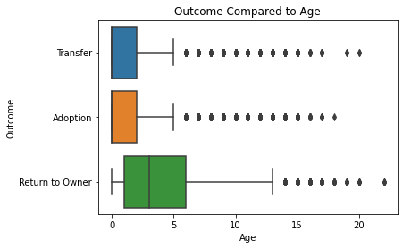
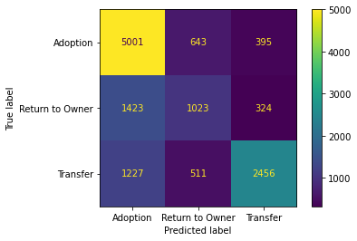
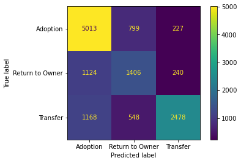

# Austin Animal Shelter Decision Tree Model

## Business Purpose

Animal shelters primarily serve their communities by helping stray or otherwise unhomed animals find a home. There are various outcomes that can happen. Ideally, the animals will be adopted, or returned to former owners if possible, but this is not feasible in all instances. The Austin Animal Shelter does have a program to transfer animals to other areas with higher demands for adoption, which is a great program, but ideally more animals can be helped more immediately. Through data analysis and my predictive model, I will attempt to identify which animals will be adopted, returned, or transferred, and try to find important factors in what determines the outcome of the animal.

## Early Data Analysis

The features involved in the data is almost entirely categorical, with the exception of the age of the animals. For the first iteration of my model, I look at the animals age, colors, sex and "fixed" status, whether the animal has a name, whether the animal is a dog or a cat, and the month of the final outcome for the animal. One stark difference in outcome is between cats and dogs. It is important to note that it seems to be incredibly rare for cats to be returned to owners.

I was surprised to learn, that there did not seem to be a large difference between the ages of animals that were adopted and those that were transferred. However, animals that were returned to owners did tend to skew older than the other groups.

It also appeared that animals that were spayed or neutered were far more likely to be adopted, while animals that were intact were more likely to be transferred.

## Making My Model

First I converted all of the categorical data to a numerical format, either by tabulating data through functions or One Hot Encoding. After that I normalized the categorical data with the age data of the animals. Once that was done, I fit the data to a decision tree classifer. This led to test results with 77% accuracy, with 65% accuracy on test data, suggesting some overfitting. The confusion matrix seems to heavily rely on guessing adoption, and is more incorrect than correct in predicting Return to Owner.

Analyzing feature importance showed that month of outcome and animal colors are not significant factors in the model, and by removing them the model is improved. The new model has a testing score of 70% with a testing score of 68%. This means that it is both more accurate and less prone to overfitting. 

## Conclusion

It appears that when determining the outcome for an animal, we should look at the following:

1. What kind of animal it is
2. Whether the animal has a name
3. How old the animal is
4. Sex and fixing status of the animal

To promote positive outcomes, we can possibly do the following:

1. For cats, encourage getting a chip implanted. It is possible that because cats are typically "indoor animals" the fear of losing them may be lower than dogs who must be taken outside.
2. Name animals. It is likely easier to bond with an animal that has a name. The adoptees can always rename an animal if they would like.
3. Run donation drives for fixing animals. They are easier to adopt (the owner does not have to pay vet to do so or worry about dealing with pregnancy), and will help reduce overall population to a more sustainable level.

Future studies:
1. Separate dogs and cats for their own models to get more specific information.
2. Get information on people who adopt so that different groups could be reached to be paired with the purrfect furry friend.
