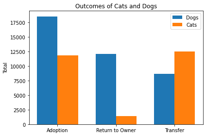

# Austin Animal Shelter Decision Tree Model

## Business Purpose

Animal shelters primarily serve their communities by helping stray or otherwise unhomed animals find a home. There are various outcomes that can happen. Ideally, the animals will be adopted, or returned to former owners if possible, but this is not feasible in all instances. The Austin Animal Shelter does have a program to transfer animals to other areas with higher demands for adoption, which is a great program, but ideally more animals can be helped more immediately. Through data analysis and my predictive model, I will attempt to identify which animals will be adopted, returned, or transferred, and try to find important factors in what determines the outcome of the animal.

## Early Data Analysis

The features involved in the data is almost entirely categorical, with the exception of the age of the animals. For the first iteration of my model, I look at the animals age, colors, sex and "fixed" status, whether the animal has a name, whether the animal is a dog or a cat, and the month of the final outcome for the animal. One stark difference in outcome is between cats and dogs.

